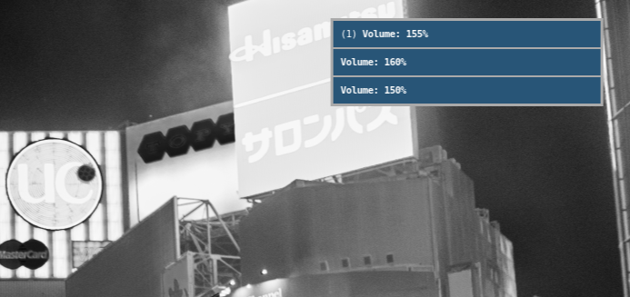

# i3-notis
Alsa volume notification keybindings for i3 / brightness Control

## Requirements
`notify-send`,`dunst`,`light`

## Procedure
- download that script file i.e to $HOME
- `chmod +x light.sh` and `chmod +x volume-raise.sh`
 

- add `bindsym XF86MonBrightnessUp exec --no-startup-id light -A 1 && /home/imanav10/light.sh `
`bindsym XF86MonBrightnessDown exec --no-startup-id light -U 1 && /home/imanav10/light.sh ` and
- add `bindsym XF86AudioRaiseVolume exec --no-startup-id pactl set-sink-volume @DEFAULT_SINK@ +5% && /home/imanav10/volume-raise.sh && pkill -RTMIN+10 i3blocks` 
`bindsym XF86AudioLowerVolume exec --no-startup-id pactl set-sink-volume 0 -5% && /home/imanav10/volume-raise.sh && pkill -RTMIN+10 i3blocks
` to `~/.config/i3/config`
- `bindsym XF86AudioMute exec pactl set-sink-mute 0 toggle && /home/imanav10/volume-raise.sh && pkill -RTMIN+10 i3blocks` to mute audio

## Screenshot

